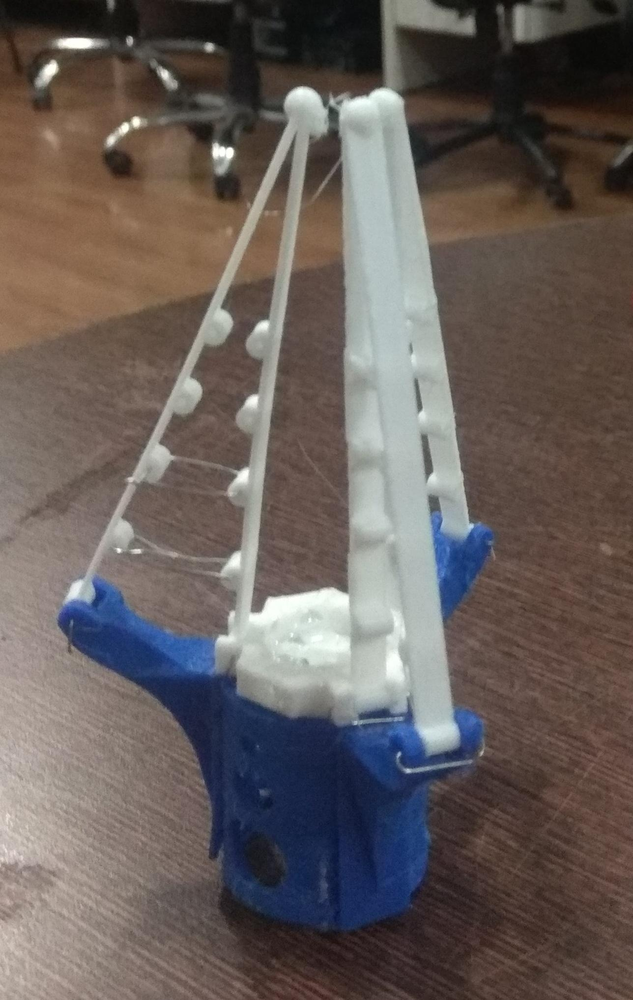
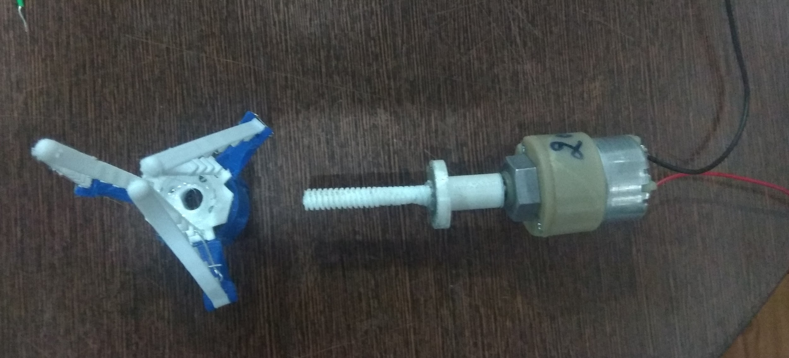

# ME6102 Project
Force Controlled Compliant Gripper

1. 3D printed a three finger compliant PLA arm capable of conforming to the object’s geometry for gripping
2. Used a servo motor to actuate the gripper with a feedback system and pressure sensors for controlling force
3. Simulated the dynamics of the gripper in MATLAB using the SynGrasp toolbox by superposing torsional spring behaviour at the hinges of finger joints for approximating the compliant behavior of the gripper

## Images of Compliant Gripper

  
  

## Gif

